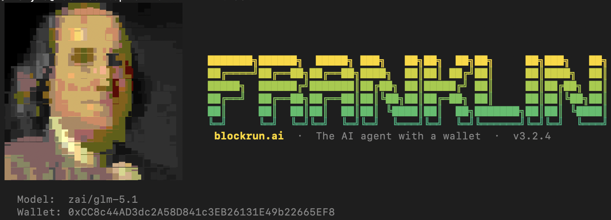

 

  

<h3>The AI agent with a wallet — now in VS Code.</h3>

  Other agents write code. Franklin writes code <em>and spends money</em> to get things done. 
  One wallet. Every model. Every paid API. Pay only for outcomes — not subscriptions.

  
  
  
  
  

  <a href="#quick-start">Quick&nbsp;start</a> ·
  <a href="#why-franklin">Why</a> ·
  <a href="#changelog">Changelog</a> ·
  <a href="#community">Community</a>

---

## Quick start

1. Open VS Code → **Extensions** (`Cmd+Shift+X` / `Ctrl+Shift+X`)
2. Search **`Franklin`** and install
3. Click the Franklin icon in the Activity Bar
4. Start chatting — free models work immediately; paid models activate once your wallet has USDC

> **YOPO — You Only Pay Outcome.** Not a subscription. Not pay-per-call. You pay only for the work Franklin delivers. Provider cost + 5%, settled per action in USDC. No monthly fees. No rate limits.

---

## Why Franklin

<table>
<tr>
<td width="33%" valign="top">

### 💳 &nbsp;Wallet-native

Franklin holds a USDC wallet and spends it for you — across 55+ models and paid APIs. No subscriptions, no API keys, no account. The wallet is the identity.

</td>
<td width="33%" valign="top">

### 🧠 &nbsp;Smart multi-model

No single model is best at everything. The Smart Router picks the right one per task from Anthropic, OpenAI, Google, xAI, DeepSeek, GLM, and more — up to 89% savings vs. always using the premium tier.

</td>
<td width="33%" valign="top">

### 🎨 &nbsp;Beyond code

Generate images & videos, pull live market data, fetch web research — all from the same chat panel, all paid from the same wallet. Every action is itemized and budget-bounded.

</td>
</tr>
</table>

---

## What's inside the VS Code panel

- **Side-panel chat** with model picker, wallet balance, and session cost
- **55+ models** switchable mid-session — Claude, GPT, Gemini, Grok, Kimi, DeepSeek, GLM, and free NVIDIA tier
- **Smart routing** — Auto / Eco / Premium profiles pick the right model per request
- **`/image` and `/video`** slash commands with cost preview before spending
- **Inline cost confirmations** — each paid action shows price + cheaper/premium alternatives
- **Extended thinking** — watch the model reason step-by-step, collapsible per turn
- **Workflow timeline** — visual timeline of every tool call and action
- **Chain switcher** — toggle Base ↔ Solana from the toolbar
- **Session history** with full-text search and auto-resume
- **Doctor panel** — one-click environment health check
- **Usage insights** — 30-day spend and session analytics

---

## Changelog

### 0.4.1
- **Vision-capable models can now see images** — `Read` on `.png` / `.jpg` / `.gif` / `.webp` inlines the bytes as a `tool_result` content block; with the gateway-side fix shipped, Sonnet / Opus / GPT-4o / Gemini describe images instead of hallucinating

### 0.4.0
- **Settings popover** — new ⚙️ button in the composer toolbar for payment chain (Base / Solana) + default image / video models; Save dismisses the popover
- **Inline edit diff cards** — Edit / Write / MultiEdit results show a green/red diff in the chat with **Open** and **Revert** buttons; Revert restores the file from an in-memory pre-edit snapshot
- **Local-path seed images for VideoGen** — `image_url` accepts local file paths (auto-converted to a data URL, 4 MB cap)
- **Routing-mode picker** — when the active model is Auto / Eco / Premium the picker shows a profile card with a toggle; click the toggle to exit routing mode and pick a specific model
- **Preserve routing label across turns** — Auto mode no longer flickers to the per-turn routed model; the label stays on "Auto" until you change it
- **Model picker search + Recent** — fuzzy search at the top, 3 most recently used models pinned under "Recent"
- **Inline media preview** — generated images / videos appear as inline cards below the tool result
- **AskUser inline prompts** — cost previews and multi-option questions render as clickable buttons
- **Streaming caret** — blinking `▍` at the end of the assistant's reply while streaming
- **Empty-state example prompts** — three clickable starter prompts on first launch
- **Inline `franklin config` commands** — `franklin config list` / `set` / `get` / `unset` in chat are handled locally
- **Default model is now `blockrun/auto`** (was `google/gemini-2.5-flash`) — matches the CLI default
- Synced with Franklin core v3.8.35 (prompt refinement for media, VideoGen async submit + polled settlement)
- Layout fixes: empty-state centering, model dropdown search clipping, settings panel positioning on narrow sidebars

### 0.3.0
- **Image & video generation** — `/image` and `/video` slash commands; the agent picks the right model, previews cost, and only spends after you confirm
- **In-chat confirmation prompts** — cost previews and choices appear as inline cards with buttons instead of silently hanging
- Synced with Franklin core v3.8.31–v3.8.34: LLM-routed media model selection, model-choice-preserving status bar, reliability pass

### 0.2.1
- Fixed model switching bug — selected model reverted to default after each turn
- Fixed Trading Dashboard on Windows (PATH delimiter + `.cmd`/`.exe` suffixes)

### 0.2.0
- **Chain switcher** — toggle Base ↔ Solana payment chain from the toolbar
- **Prefetch status indicator** — live pulse when the agent pulls market data before responding
- Updated free model lineup (GLM-4.7, Qwen3 Coder 480B, Llama 4 Maverick, Qwen3 Next 80B Thinking)
- Synced with Franklin core v3.8.9–v3.8.30

### 0.1.0
- Initial release — chat panel, model picker, wallet balance, session history, doctor panel, usage insights, trading dashboard

---

## Community

- [Telegram](https://t.me/blockrunAI) — realtime help, bug reports, feature requests
- [@BlockRunAI](https://x.com/BlockRunAI) — release notes, demos
- [Issues](https://github.com/BlockRunAI/Franklin/issues) — bugs and feature requests

---

## License

Apache-2.0. See [LICENSE](LICENSE).

---

**The AI agent with a wallet.** 
YOPO — You Only Pay Outcome. Your wallet. Your budget. Your results.

 

From the team at <a href="https://blockrun.ai">BlockRun</a>.

